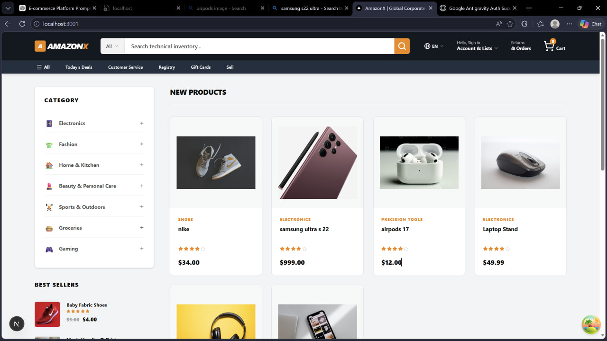

# 🛒 E-Commerce Platform

<p align="center">
  
</p>

<p align="center">
  <b>Modern Full-Stack E-Commerce Application</b><br/>
  Built for scalability, performance, and real-world production
</p>

---

## 🚀 Overview

A **production-ready full-stack e-commerce platform** designed with a powerful admin dashboard, dynamic product management, and a seamless shopping experience.

This project demonstrates **end-to-end system design** — from frontend UI/UX to backend APIs and database architecture.

---

## ✨ Features

### 🛠️ Admin Dashboard
- Create, edit, delete, and publish products  
- Manage categories and product visibility  
- Advanced filtering and search  
- Real-time product updates  

### 🛍️ User Experience
- Browse products with category filtering  
- Add to cart functionality  
- Smooth checkout flow  
- Fully responsive UI  

### ⚙️ Backend System
- RESTful API built with NestJS  
- Scalable and modular architecture  
- Secure data handling using Prisma ORM  

---

## 🧰 Tech Stack

| Layer        | Technology        |
|-------------|------------------|
| Frontend    | Next.js          |
| Backend     | NestJS           |
| Database    | Prisma ORM       |
| Language    | TypeScript       |

---

## 📂 Project Structure

```
ecommerce-app/
│── backend/    # NestJS API
│── frontend/   # Next.js application
│── assets/     # Images & screenshots
```

---

## ⚡ Getting Started

### 1️⃣ Clone the repository
```
git clone https://github.com/furoyal7/e-commerce.git
cd e-commerce
```

---

### 2️⃣ Backend Setup
```
cd backend
npm install
npm run start:dev
```

---

### 3️⃣ Frontend Setup
```
cd frontend
npm install
npm run dev
```

---

## 🔐 Environment Variables

Create a `.env` file inside the backend directory:

```
DATABASE_URL=your_database_url
JWT_SECRET=your_secret_key
```

---

## 📌 API Overview

| Method | Endpoint                     | Description                  |
|-------|-----------------------------|------------------------------|
| GET   | /api/products               | Get all published products   |
| POST  | /api/products               | Create product (Admin)       |
| PATCH | /api/products/:id/publish   | Publish product              |
| POST  | /api/cart                   | Add item to cart             |

---

## 📸 Preview

The screenshot above shows the **live UI of the platform**, including:
- Product listing page  
- Category sidebar  
- Clean and modern UI layout  

---

## 🎯 Future Improvements

- 💳 Payment integration (Stripe)  
- 🔐 Authentication & authorization system  
- 📦 Order tracking & management  
- 📊 Admin analytics dashboard  
- ⭐ Product reviews & ratings  

---

## 🌍 Live Demo

👉 *(Add your deployed link here)*

---

## 👨‍💻 Author

**Fuad Kedir**  
Software Engineer | Full Stack | AI Engineer  

---

## ⭐ Support

If you like this project:

- ⭐ Star the repository  
- 🍴 Fork it  
- 🛠️ Contribute  

---

## 💡 Philosophy

> Build scalable systems.  
> Write clean code.  
> Deliver real impact.

---

<p align="center">
  
</p>
